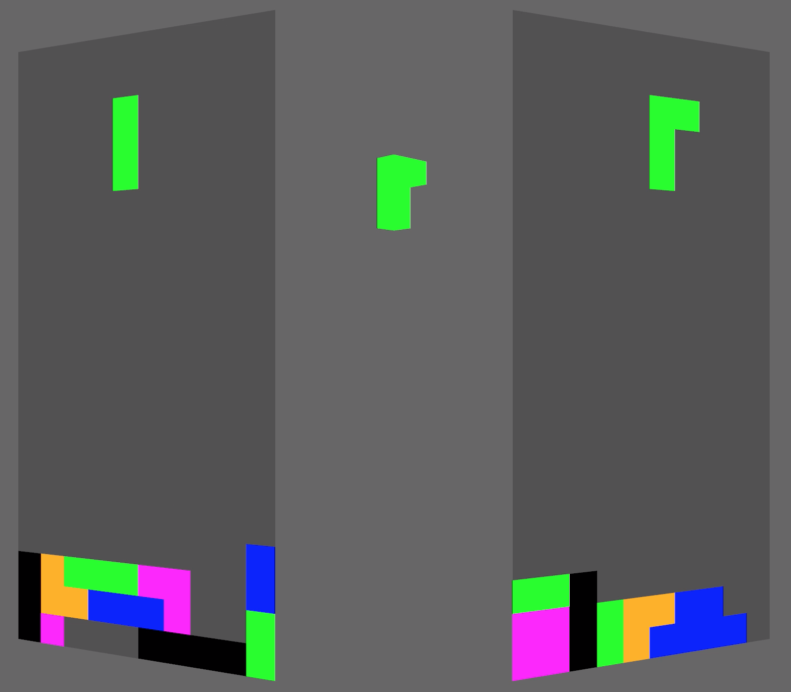

# Projectris

Also known as Shadow Tetris. It's 3D Tetris, but you only get to play the
shadows of the piece. You have to play two games of regular Tetris at once,
but when you rotate the piece in one game, it might change the other!

## Controls

The default controls in `config.ron` are:

- A + Left: Rotate CCW in the left grid
- A + Right: Rotate CW in the left grid
- F + Left: Rotate CCW in the right grid
- F + Right: Rotate CW in the right grid

- S + Left: Translate left in the left grid
- S + Right: Translate right in the left grid
- D + Left: Translate left in the right grid
- D + Right: Translate right in the right grid

- Space: Fast drop
